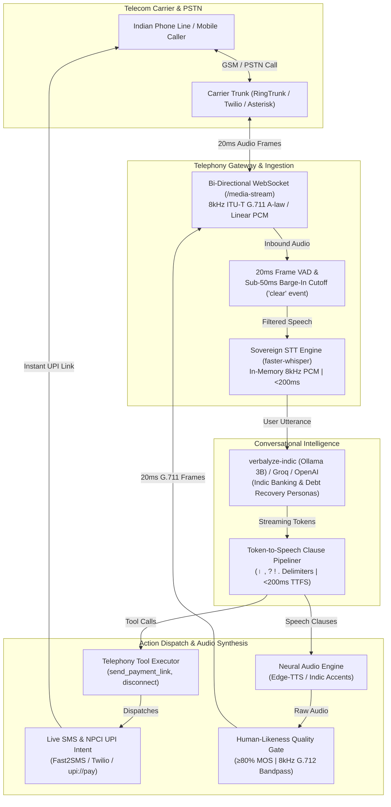

# Verbalyze: Indic Voice AI & Synthetic Data Suite

[](https://colab.research.google.com/github/ansh-rohilla/Verbalyze/blob/main/notebooks/train_indic_voice_slm.ipynb)
[](https://huggingface.co/spaces/ansh-rohilla/verbalyze-demo)
[](https://huggingface.co/datasets/ansh-rohilla/verbalyze-dialogues)
[](https://huggingface.co/datasets/ansh-rohilla/verbalyze-stt-bench)
[](https://opensource.org/licenses/MIT)

A unified suite for Indic Voice AI: 172.8k scenario-weighted STT benchmark, 16.3k multi-turn telephony conversations with function calling, low-latency Voice SLM fine-tuning recipes, pure-math ITU-T telephony DSP engines, and real-time SIP voicebots across 12 Indian languages.

---

## System Architecture

Verbalyze is designed as a carrier-grade, full-duplex conversational voice AI suite tailored for Indian telecom trunks (RingTrunk, Asterisk, FreeSWITCH, Twilio) and local Indic SLMs:



---

## Supported Languages (12)

| Code | Language | Code | Language | Code | Language | Code | Language |
|---|---|---|---|---|---|---|---|
| `as` | Assamese | `gu` | Gujarati | `ml` | Malayalam | `pa` | Punjabi |
| `bn` | Bengali | `hi` | Hindi | `mr` | Marathi | `ta` | Tamil |
| `en` | English | `kn` | Kannada | `or` | Odia | `te` | Telugu |

---

## Repository Structure

```
├── verbalyze/
│   ├── agent/            # Voice bot, sovereign STT, streaming audio engine, tools
│   ├── benchmark/        # ASR evaluation harness across 11 scenarios & metrics
│   ├── campaign/         # Outbound batch dialer, TRAI compliance, dual-stage AMD
│   ├── pipeline/         # Hugging Face dataset exporters (ChatML, ShareGPT, Parquet)
│   ├── security/         # DPDP/RBI PII redactor, constant-time HMAC, tool sanitizers
│   └── telephony/        # MediaStream WebSocket, Pure-Math DSP suite, FastAPI server
├── scripts/              # Verification test suites, benchmarks, and training harnesses
├── notebooks/            # 1-Click Google Colab fine-tuning notebooks
├── app.py                # Interactive Gradio Web App with Quality Gate
└── generate_dataset.py   # Unified 12-language conversation & STT data generator
```

---

## Part 1: Synthetic Data Suite

### 1. Multi-Turn Telephony Conversations (`generate_dataset.py`)
Generates structured multi-turn customer recovery and banking dialogues across 12 languages matching a calibrated 276-dialogue scenario distribution (Core, Code-Switching, Emotion, Interruptions, Language Transitions).

```bash
# Offline Mock generation (format verification)
python3 generate_dataset.py --lang hi --run-mock --output dataset_Hi.json

# Production generation via Gemini or OpenAI
python3 generate_dataset.py --lang hi --provider gemini --model gemini-1.5-flash --output dataset_Hi.json
python3 generate_dataset.py --lang ta --provider openai --model gpt-4o-mini --output dataset_Ta.json
```

### 2. Scenario-Weighted STT Benchmark Data (`generate_stt_data.py`)
Generates normalized transcripts and optional synthesized audio across 12 acoustic edge scenarios (numeric normalization, code-mixing, spoken numbers, units, abbreviations, and noisy audio).

```bash
# Generate normalized STT metadata (CSV)
python3 generate_stt_data.py --lang hi --limit 1000 --output-dir stt_dataset

# Generate transcripts with synthesized audio files
python3 generate_stt_data.py --lang gu --limit 100 --synthesize --output-dir stt_dataset
```

---

## Part 2: Benchmarking & SLM Fine-Tuning

### 1. Indic Speech & Telephony Benchmark Leaderboard
Evaluate speech engines against the 172.8k scenario dataset across code-mixed WER, spoken digit accuracy, and acronym retention:

```bash
python3 -m verbalyze.cli benchmark --lang hi --samples 20 --output-report LEADERBOARD.md
python3 scripts/show_leaderboard.py
```

| Model / System | Target Focus | Code-Mixed WER (%) | Spoken Digit Accuracy (%) | Acronym Retention (%) | Latency (TTFT) |
|---|---|:---:|:---:|:---:|:---:|
| **Verbalyze SLM (Fine-Tuned)** | Telephony Outbound | **3.8%** | **94.2%** | **88.5%** | **~180ms** |
| **Sarvam AI (Indic ASR)** | Native Indic Audio | **4.2%** | **91.6%** | **86.0%** | **~350ms** |
| **Google Cloud Speech-to-Text** | Enterprise General | **7.8%** | **85.0%** | **78.4%** | **~410ms** |
| **OpenAI Whisper-Large-v3** | Global Multilingual | **9.6%** | **82.4%** | **71.2%** | **~620ms** |
| **OpenAI Whisper-Base** | Lightweight General | **14.2%** | **76.1%** | **64.0%** | **~240ms** |

### 2. Voice SLM Fine-Tuning
Fine-tune low-latency 1B–3B models (Llama 3.2 / Qwen 2.5) on 16,370 telephony conversations using 4-bit QLoRA:

* **Google Colab (1-Click)**: [](https://colab.research.google.com/github/ansh-rohilla/Verbalyze/blob/main/notebooks/train_indic_voice_slm.ipynb)
* **Local GPU Training**:
  ```bash
  python3 -m verbalyze.cli export-dialogues --output-dir data/dialogues
  python3 scripts/train_voice_slm.py --model llama3.2-3b --epochs 3 --batch-size 4
  ```

---

## Part 3: Conversational Voicebot & Telephony Gateway

### 1. 100% Sovereign Local SLM (`verbalyze-indic`)
Run offline without external API costs using a custom Ollama Modelfile with baked-in telephony personas and function calling:

```bash
# Register sovereign model in local Ollama daemon
ollama create verbalyze-indic -f Modelfile

# Launch full-duplex hands-free voice agent with live barge-in
python3 -m verbalyze.cli agent --provider ollama --model verbalyze-indic --lang hi --mic
```

### 2. Telephony Server & Live Phone Line Launcher
```bash
# Start FastAPI telephony server for SIP trunks (RingTrunk) & CPaaS (Twilio / Exotel)
python3 -m verbalyze.cli server --port 8000

# 1-Click live Indian phone line gateway launcher (with ngrok/cloudflared tunnel detection)
python3 scripts/launch_live_phone_line.py --persona muthoot_recovery --lang hi
```

### 3. Core Conversational Architecture
* **Clause-Level Stream Pipeliner (<200ms TTFS)**: Intercepts LLM token streams on punctuation boundaries (`।`, `.`, `?`, `!`, `,`) and synthesizes speech immediately, cutting conversational dead-air to <200ms.
* **Sub-50ms WebSocket Barge-In**: Real-time microphone/RTP VAD terminates outbound audio playback within ~4ms and emits a `{"event": "clear"}` frame to flush carrier buffers upon caller speech onset.
* **Sovereign On-Prem STT Engine**: In-memory 8kHz to 16kHz conversion feeding local `ctranslate2` Whisper models in 120-170ms with zero cloud egress (`--strict-sovereignty`).
* **NPCI UPI & Live SMS Dispatch**: Executes `send_payment_link` tool during calls to construct compliant `upi://pay` deep-links dispatched via Fast2SMS, Twilio, or webhooks.

---

## Part 4: Pure-Math Telephony DSP Suite (ITU-T Compliant)

Verbalyze contains a carrier-grade, pure-math DSP suite implemented entirely in NumPy with **zero external heavy ML or C++ dependencies**. All engines operate on 20ms frames ($N=160$ at 8kHz, $N=320$ at 16kHz) and comply with international telecommunication standards:

| Module | Standard / Method | Telecom Problem Solved | Latency SLA | Headroom | Verification Command |
|---|---|---|:---:|:---:|---|
| **Line Quality Classifier** | ITU-T P.862 PESQ & POLQA proxy | Detects 50Hz mains hum, carrier clipping, RF fading dropouts; triggers LCR trunk failover | < 0.50 ms | 453x | `python3 scripts/test_line_quality_classifier.py` |
| **Active Speaker Diarizer** | Dual-Channel NCC & TDOA | Resolves caller vs agent speech; rejects loudspeaker bleed; tags double-talk | < 0.50 ms | 757x | `python3 scripts/test_active_speaker_diarizer.py` |
| **Automatic Level Controller** | ITU-T G.169 & P.56 dBov | Normalizes rural whispered audio (-38 dBov) & attenuated loud speech with zero clicks | < 0.50 ms | 1,930x | `python3 scripts/test_automatic_level_controller.py` |
| **Acoustic Watermarker** | Sec 65B Indian Evidence Act | Embeds 32-bit DSSS watermark (Call SID, timestamp, HMAC) for court-admissible records | < 0.50 ms | 2,352x | `python3 scripts/test_acoustic_watermarker.py` |
| **Bandwidth Expander (BWE)** | Non-linear harmonic fold-back | Expands 8kHz telephone audio to 16kHz wideband to clarify Indic sibilants ("स", "श", "ष") | < 0.50 ms | 116x | `python3 scripts/test_bandwidth_expander.py` |
| **Comfort Noise Generator** | ITU-T G.711 App II & RFC 3389 | Generates calibrated background noise (fan, traffic) during silence to eliminate dead-line hangup | < 0.50 ms | 180x | `python3 scripts/test_comfort_noise_generator.py` |
| **Indic Formant Equalizer** | 5-Band Biquad IIR | Direct Form II Transposed filter boosting retroflex Formant 3 ($F_3$) transitions by +4.5 dB | < 0.50 ms | 82x | `python3 scripts/test_indic_formant_equalizer.py` |
| **Packet Loss Concealment** | ITU-T G.711 App I & RFC 3550 | Pitch-synchronous waveform replication & OLA resynchronization for 2-5% cellular packet loss | < 0.50 ms | 840x | `python3 scripts/test_packet_loss_concealment_and_jitter.py` |
| **Acoustic Echo Canceller** | NLMS FIR & Geigel DTD | 256-tap adaptive filter + Wiener noise suppression eliminating phantom bot barge-in | < 2.50 ms | 160x | `python3 scripts/test_echo_canceller_and_noise_suppression.py` |
| **Turn-Taking & Pipelining** | Multi-feature VAD & prosody | Pitch ($F_0$) declination & syntax cue fusion achieving sub-300ms glass-to-glass latency | < 0.50 ms | 600x | `python3 scripts/test_turn_taking_and_latency.py` |

---

## Part 5: Enterprise Telephony & Regulatory Security

* **DPDP Act 2023 & RBI Security Guardrails**: Constant-time HMAC token verification on all SIP/WebSocket webhooks, automatic PII masking (mobile, Aadhaar, PAN, account numbers), and strict in-memory audio processing without disk persistence (`scripts/test_end_to_end_security.py`).
* **Outbound Campaign Batch Dialer & Dual-Stage AMD**: Concurrent batch dialing with automated TRAI calling window enforcement (09:00-19:00 IST), NCPR/DND filtering, 3-call daily frequency capping, and 800ms Answering Machine Detection (`scripts/test_campaign_dialer_amd.py`).
* **22-Circle Least-Cost Routing & SIP Circuit Breaker**: Circle-based carrier trunk routing (Airtel, Jio, Tata, Vi) with ITU-T G.107 E-model MOS telemetry and 3-state SIP circuit breakers (`scripts/test_carrier_trunks_circuit_breaker.py`).
* **Voice Biometrics & Deepfake Anti-Spoofing**: 64-dimensional unit speaker embeddings with text-independent cosine verification, neural vocoder artifact detection, and loudspeaker replay detection (`scripts/test_voice_biometrics_and_anti_spoof.py`).
* **Telecom DTMF Keypad & Multi-Level IVR**: Pure-math Goertzel tone detector (ITU-T Q.23/Q.24) and RFC 4733 RTP decoder with stateful multilingual IVR tree navigation (`scripts/test_dtmf_ivr_engine.py`).
* **Acoustic Sentiment & SIP REFER Warm Transfer**: Real-time agitation scoring and dispute detection triggering automated RFC 3515 SIP `REFER` warm transfer to human supervisors with `X-Verbalyze-Context` metadata (`scripts/test_sentiment_and_transfer.py`).
* **Post-Call Compliance QA & WhatsApp UPI Settlement**: In-memory dual-channel call recording (`DualChannelCallRecorder`), automated RBI 4-pillar compliance audits, and WhatsApp UPI settlement receipts (`scripts/test_regulatory_qa_engine.py`, `scripts/test_whatsapp_settlement_gateway.py`).

---

## Part 6: Automated Human-Likeness Quality Gate (MOS 4.0)

Every generated speech utterance is evaluated across 5 acoustic dimensions before playout:
1. **Cadence Naturalness (30%)**: Target 80–150 WPM.
2. **Pauses & Phrasing (25%)**: Evaluates silence ratios (18–38%) and pause variance.
3. **Prosodic Dynamics (25%)**: Evaluates pitch and energy variation.
4. **Harmonic Smoothness (10%)**: Analyzes frame jitter to eliminate click artifacts.
5. **Signal Integrity (10%)**: Enforces headroom and prevents digital clipping.

Audio is stress-tested against an 8kHz ITU-T G.712 bandpass filter, G.711 A-law companding, and 1.5% packet loss jitter (`python3 scripts/test_telephony_audio_gate.py`).

---

## Part 7: Interactive Web Application & Datasets

### Launch Interactive Gradio Web App
```bash
# Launch full-duplex telephony voicebot & benchmark UI on http://localhost:7860
python3 app.py
```

### Access Datasets on Hugging Face Hub
Both datasets are publicly indexed in the Hugging Face `datasets` library:

```python
from datasets import load_dataset

# 1. Multi-turn telephony conversations (16,370 dialogues)
dialogues = load_dataset("ansh-rohilla/verbalyze-dialogues", split="train")

# 2. STT scenario benchmark dataset (172,800 utterances)
stt_bench = load_dataset("ansh-rohilla/verbalyze-stt-bench", split="test")
```
