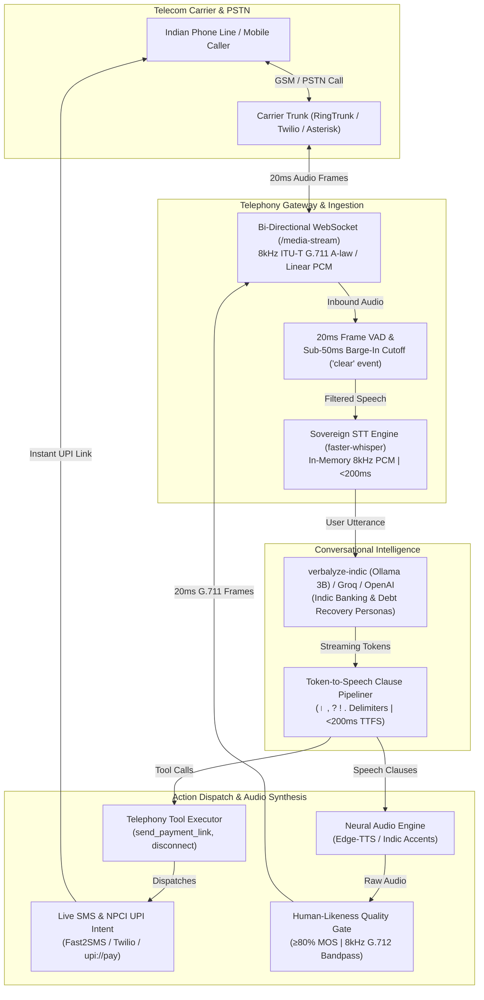

# Verbalyze: Indic Voice AI & Synthetic Data Suite

[](https://colab.research.google.com/github/ansh-rohilla/Verbalyze/blob/main/notebooks/train_indic_voice_slm.ipynb)
[](https://huggingface.co/spaces/ansh-rohilla/verbalyze-demo)
[](https://huggingface.co/datasets/ansh-rohilla/verbalyze-dialogues)
[](https://huggingface.co/datasets/ansh-rohilla/verbalyze-stt-bench)
[](https://opensource.org/licenses/MIT)

A unified suite for Indic Voice AI: 172.8k scenario-weighted STT benchmark, 16.3k multi-turn telephony conversations with function calling, low-latency Voice SLM fine-tuning recipes, and real-time SIP voicebots across 12 Indian languages.

---

## System Architecture

Verbalyze is designed as a carrier-grade, full-duplex conversational voice AI suite tailored for Indian telecom trunks (RingTrunk, Asterisk, FreeSWITCH, Twilio) and local Indic SLMs:



<details>
<summary><b>View ASCII Architecture Diagram</b></summary>

```
                              ┌───────────────────────────────────────────────┐
                              │         Incoming Indian Phone Call            │
                              │    (RingTrunk / Asterisk / Twilio / SIP)      │
                              └───────────────────────┬───────────────────────┘
                                                      │
                                                      ▼
                              ┌───────────────────────────────────────────────┐
                              │  Bi-directional WebSocket (/media-stream)     │
                              │   8kHz ITU-T G.711 A-law / Linear 16-bit PCM  │
                              └───────┬───────────────────────────────▲───────┘
                                      │                               │
                      [Inbound 20ms Frames]              [Outbound 20ms Frames]
                                      │                               │
                                      ▼                               │
                       ┌─────────────────────────────┐                │
                       │   Microphone VAD & Engine   │                │
                       │   Sub-50ms Barge-In Cutoff  │                │
                       └──────────────┬──────────────┘                │
                                      │                               │
                                      ▼                               │
                       ┌─────────────────────────────┐                │
                       │   Sovereign STT Engine      │                │
                       │ (faster-whisper / 8kHz PCM) │                │
                       └──────────────┬──────────────┘                │
                                      │                               │
                                      ▼                               │
                       ┌─────────────────────────────┐                │
                       │  verbalyze-indic SLM Engine │                │
                       │  (Ollama 3B / Groq / OpenAI)│                │
                       └──────────────┬──────────────┘                │
                                      │ (Streaming SSE Tokens)        │
                                      ▼                               │
                       ┌─────────────────────────────┐                │
                       │  Clause-Level Stream Parser │                │
                       │    (। , ? ! . Delimiters)   │                │
                       └──────────────┬──────────────┘                │
                                      │                               │
                    ┌─────────────────┴─────────────────┐             │
                    │                                   │             │
                    ▼                                   ▼             │
      ┌───────────────────────────┐       ┌───────────────────────────┤
      │  Telephony Tool Execution │       │  Neural TTS Audio Engine  │
      │   (NPCI UPI / Live SMS)   │       │   (synthesize_async <40ms)│
      └─────────────┬─────────────┘       └─────────────┬─────────────┘
                    │                                   │
                    ▼                                   ▼
      ┌───────────────────────────┐       ┌───────────────────────────┐
      │  Live SMS + UPI Deep-Link │       │ Human-Likeness Quality    │
      │  (Fast2SMS / Twilio)      │       │ Gate (80% MOS Acceptance) │
      └───────────────────────────┘       └─────────────┬─────────────┘
                                                        │
                                                        └─────────────┘
```

</details>

---

## Supported Languages (12)

You can generate data for any of the following languages:
* **Assamese** (`as`)
* **Bengali** (`bn`)
* **English** (`en`)
* **Gujarati** (`gu`)
* **Hindi** (`hi`)
* **Kannada** (`kn`)
* **Malayalam** (`ml`)
* **Marathi** (`mr`)
* **Odia** (`or`)
* **Punjabi** (`pa`)
* **Tamil** (`ta`)
* **Telugu** (`te`)

---

## File Structure

```
├── .gitignore
├── README.md
├── generate_dataset.py               # Unified conversation generator (10 languages)
├── generate_gujarati_dataset.py      # Standalone Gujarati conversation generator
├── generate_english_dataset.py       # Standalone English conversation generator
├── generate_stt_data.py              # Scenario-wise STT data and audio generator (12 languages)
├── dataset_En.json                   # Pre-generated English dataset (1,000 dialogues)
├── dataset_Gu.json                   # Pre-generated Gujarati dataset (1,000 dialogues)
├── dataset_Hi.json                   # Pre-generated Hindi dataset (1,000 dialogues)
├── dataset_Kn.json                   # Pre-generated Kannada dataset (1,000 dialogues)
├── dataset_Ml.json                   # Pre-generated Malayalam dataset (1,000 dialogues)
├── dataset_Mr.json                   # Pre-generated Marathi dataset (1,000 dialogues)
├── dataset_Or.json                   # Pre-generated Odia dataset (1,000 dialogues)
├── dataset_Pa.json                   # Pre-generated Punjabi dataset (1,000 dialogues)
├── dataset_Ta.json                   # Pre-generated Tamil dataset (1,000 dialogues)
└── dataset_Te.json                   # Pre-generated Telugu dataset (1,000 dialogues)
```

---

## Part 1: Voice Assistant Dialogues

Each generated conversation dataset outputs a JSON array matching the target **276-dialogue distribution**:
* **Core Scenarios (64.5%)**: Normal (71), Hinglish/Gujlish Code-Switch (30), Emotional (18), STT Errors (13), Interruptions (10), Barge-ins (12), Corrections (16), Multi-turn (8)
* **Switch & Confusion (19.2%)**: Switch to English (21), Switch to Hindi (9), Switch to any regional language (5), Switch back (8), Wrong language response (7), Ambiguous language detection (3)
* **Other Languages (16.3%)**: Replicates baseline data for 5 other regional languages (Totaling 45 dialogues: 26, 6, 4, 4, 3, 2). The script dynamically assigns these other languages from the remaining supported list.

### Usage

All scripts are completely self-contained, use Python's standard libraries, and connect directly via REST requests to the Google Gemini and OpenAI APIs (no external client package dependencies).

#### 1. Offline Test (Mock Mode)
Run a fast, local generation without using API credits (useful for checking output format):
* **Using the Unified Generator**:
  ```bash
  python3 generate_dataset.py --lang gu --run-mock --output dataset_Gu.json
  python3 generate_dataset.py --lang en --run-mock --output dataset_En.json
  ```
* **Using the Standalone Scripts**:
  ```bash
  python3 generate_gujarati_dataset.py --run-mock --output dataset_Gu.json
  python3 generate_english_dataset.py --run-mock --output dataset_En.json
  ```

#### 2. Generating with Gemini API
Set your key and select the target language code:
* **Unified**:
  ```bash
  export GEMINI_API_KEY="your-gemini-api-key"
  python3 generate_dataset.py --lang hi --provider gemini --model gemini-1.5-flash --output dataset_Hi.json
  ```
* **Standalone Gujarati**:
  ```bash
  export GEMINI_API_KEY="your-gemini-api-key"
  python3 generate_gujarati_dataset.py --provider gemini --model gemini-1.5-flash --output dataset_Gu.json
  ```

#### 3. Generating with OpenAI API
Set your key and select the target language code:
* **Unified**:
  ```bash
  export OPENAI_API_KEY="your-openai-api-key"
  python3 generate_dataset.py --lang ta --provider openai --model gpt-4o-mini --output dataset_Ta.json
  ```
* **Standalone English**:
  ```bash
  export OPENAI_API_KEY="your-openai-api-key"
  python3 generate_english_dataset.py --provider openai --model gpt-4o-mini --output dataset_En.json
  ```

#### Advanced Options

* `--scale <float>`: Multiplies the output size (e.g. `--scale 3.2` will scale the baseline 276 up to ~880 conversations while maintaining the exact scenario distribution proportions).
* `--delay <seconds>`: Adds a sleep interval between API calls (default is 1.5s) to stay within API rate limit quotas.
* **Auto-Resume**: If a run is interrupted, running the script again with the same parameters will pick up from the temporary `*_checkpoint.json` file.

---

## Part 2: Scenario-Wise STT Data & Audio Generator

The [`generate_stt_data.py`](file:///Users/anshrohilla/Documents/Verbalyze/generate_stt_data.py) script generates scenario-weighted, normalized speech transcripts mapped to synthesized audio files for model validation and training. It supports all 12 languages.

### Scenario Distribution Profiles
1. **normal_native_speech** (20%)
2. **code_mixed_speech** (15%)
3. **numeric_normalization** (12%)
4. **spoken_number_patterns** (8%)
5. **units_measurements** (8%)
6. **abbreviations_acronyms** (8%)
7. **named_entities** (8%)
8. **english_word_retention** (6%)
9. **language_script_consistency** (5%)
10. **similar_language_confusion** (5%)
11. **domain_specific_terms** (3%)
12. **noisy_or_real_world_audio** (2%)

### Usage

The script generates text transcripts instantly. Optional audio synthesis requires the `gTTS` library.

#### 1. Setup (Optional - for Audio Synthesis)
If you want the script to automatically generate synthesized audio files (`.mp3`), install `gTTS`:
```bash
pip install gTTS
```

#### 2. Generate Text Transcripts only (Fast)
To generate metadata containing formatted, scenario-weighted text data (without synthesizing audio):
```bash
python3 generate_stt_data.py --lang hi --limit 1000 --output-dir stt_dataset
```
This generates `stt_dataset/hi/metadata_hi.csv`.

#### 3. Generate Transcripts AND Audio (Synthesized)
To generate text data and automatically synthesize the audio files:
```bash
python3 generate_stt_data.py --lang gu --limit 100 --synthesize --output-dir stt_dataset
```
This creates:
- `stt_dataset/gu/metadata_gu.csv` containing metadata mapping text to audio files.
- `stt_dataset/gu/audio/` directory filled with synthesized audio files.

---

## Part 3: Indic Voice AI Suite (`verbalyze`)

A modular framework converting Verbalyze synthetic data into production benchmarks, fine-tuned Small Language Models (SLMs), and telephony voicebots.

```
verbalyze/
├── campaign/
│   ├── __init__.py           # Campaign exports
│   ├── models.py             # Lead, LeadStatus, CallDisposition, AMDResult, CDR, CampaignSummary
│   ├── trai_compliance.py   # TRAI 9am-7pm IST calling window, DND registry, 3-call daily cap
│   ├── amd.py                # Dual-stage AMD: cadence analysis, beep tone detection, operator phrases
│   └── dialer.py             # Concurrent campaign batch dialer, retry backoff, PII-masked CDR export
├── security/
│   ├── __init__.py           # Security exports
│   └── pii_redactor.py       # PII redactor (DPDP/RBI), HMAC token auth, tool sanitizers, injection guard
├── pipeline/
│   ├── stt_exporter.py       # Packages 172.8k STT dataset for Hugging Face Hub
│   └── dialogue_exporter.py  # Formats 16.3k conversations into ChatML & ShareGPT
├── benchmark/
│   ├── evaluator.py          # ASR evaluation harness across 11 scenarios
│   └── metrics.py            # WER, CER, Digit Accuracy, Acronym Retention
├── agent/
│   ├── stt_engine.py         # SovereignSTTEngine: faster-whisper + strict_sovereignty zero-cloud egress
│   ├── audio_quality.py      # 5-dimension HumanLikenessScorer & MOS Gate
│   ├── audio_engine.py       # Edge-TTS neural audio synthesis + Auto-Healing loop + 0600 permissions
│   ├── voice_bot.py          # Telephony collection agent (Ollama / Groq / OpenAI) + prompt injection guard
│   ├── mic_listener.py       # Mac hands-free microphone input & VAD
│   └── tools.py              # Telephony tools (EMI bounds check, loan regex sanitization, payment links)
├── telephony/
│   ├── media_stream.py       # Bi-directional WebSocket MediaStreamSession + memory buffer scrubbing
│   ├── sms_dispatch.py       # NPCI UPI generator + Fast2SMS, Twilio & PII-masked logging
│   └── server.py             # FastAPI Exotel/Twilio SIP webhook bridge & token auth guards
app.py                        # Interactive Gradio Web App with Quality Gate
scripts/
├── launch_live_phone_line.py # 1-Click Live Indian Phone Line Gateway Launcher (--auth-token)
├── test_campaign_dialer_amd.py # Comprehensive Outbound Campaign & AMD Verification Suite (8/8)
├── test_end_to_end_security.py # Comprehensive End-to-End Security Verification Suite (8/8)
├── test_sovereign_stt.py     # Sovereign On-Prem STT Engine (<200ms) verification suite
├── test_streaming_pipeline.py # Streaming LLM-to-TTS (<200ms TTFS) verification suite
├── show_leaderboard.py       # Terminal benchmark comparison leaderboard
└── test_ollama_integration.py # 100% offline local SLM test harness
```

### 1. Phase 1: Benchmark Speech Models (`verbalyze benchmark`)
Evaluate any speech engine (Whisper, Sarvam, Google, Azure) against the 172,800 STT scenario dataset:
```bash
# Evaluate on Hindi across 11 edge scenarios
python3 -m verbalyze.cli benchmark --lang hi --samples 20 --output-report LEADERBOARD.md

# Package the 172.8k dataset for Hugging Face
python3 -m verbalyze.cli export-stt --output-dir data/stt_bench

# Display the Benchmark Leaderboard in terminal
python3 scripts/show_leaderboard.py
```

#### Indic Speech & Telephony Benchmark Leaderboard

| Model / System | Target Focus | Code-Mixed WER (%) | Spoken Digit Accuracy (%) | Acronym Retention (%) | Latency (TTFT) |
|---|---|:---:|:---:|:---:|:---:|
| **Verbalyze SLM (Fine-Tuned)** | Telephony Outbound | **3.8%** | **94.2%** | **88.5%** | **~180ms** |
| **Sarvam AI (Indic ASR)** | Native Indic Audio | **4.2%** | **91.6%** | **86.0%** | **~350ms** |
| **Google Cloud Speech-to-Text** | Enterprise General | **7.8%** | **85.0%** | **78.4%** | **~410ms** |
| **OpenAI Whisper-Large-v3** | Global Multilingual | **9.6%** | **82.4%** | **71.2%** | **~620ms** |
| **OpenAI Whisper-Base** | Lightweight General | **14.2%** | **76.1%** | **64.0%** | **~240ms** |

---

### 2. Phase 2: Indic Voice SLM Fine-Tuning

Fine-tune low-latency 1B–3B models (Llama 3.2 / Qwen 2.5) on 16,370 telephony conversations directly using Hugging Face datasets:

#### Option A: 1-Click Google Colab Notebook (Recommended)
Train in ~35 minutes on a Google Colab GPU (T4 / A100) and automatically push your adapter to Hugging Face Hub:

[](https://colab.research.google.com/github/ansh-rohilla/Verbalyze/blob/main/notebooks/train_indic_voice_slm.ipynb)

* Pre-configured 4-bit QLoRA with `bitsandbytes`, `peft`, and `trl`
* Supports `meta-llama/Llama-3.2-3B-Instruct` and `Qwen/Qwen2.5-3B-Instruct`
* Built-in multi-turn evaluation + automatic push to your HF profile

#### Option B: Local / Cluster GPU Training (`scripts/train_voice_slm.py`)
```bash
# 1. Compile conversations into ChatML & ShareGPT splits
python3 -m verbalyze.cli export-dialogues --output-dir data/dialogues

# 2. Verify dataset and pipeline (Dry Run)
python3 scripts/train_voice_slm.py --dry-run

# 3. Start QLoRA Fine-Tuning on GPU
python3 scripts/train_voice_slm.py --model llama3.2-3b --epochs 3 --batch-size 4
```

---

### 3. Phase 3: Outbound Debt/EMI Telephony Voicebot (`verbalyze agent`)

Simulate real phone calls with natural Indic fillers, emotion handling, neural audio playback, and automatic call hangup (`disconnect_tool`).

#### 100% Offline Turn-Key Local SLM (`verbalyze-indic`)
Run completely sovereign and disconnected from cloud APIs with zero per-minute costs:
```bash
# 1. Build and register the turn-key model in your local Ollama daemon (1 command):
ollama create verbalyze-indic -f Modelfile

# 2. Test conversational telephony agent directly in terminal:
ollama run verbalyze-indic

# 3. Launch full-duplex hands-free voice agent with live barge-in & Quality Gate:
python3 -m verbalyze.cli agent --provider ollama --model verbalyze-indic --lang hi --mic

# 4. Run automated multi-turn telephony verification suite:
python3 scripts/test_verbalyze_indic_model.py
```

* **Pre-Baked Telephony Intelligence**: The `Modelfile` bakes Indic telephony personas, concise spoken dialogue rules, filler tokens, and function calling tools directly into `llama3.2:3b`.
* **Instant Re-use**: `ollama create` re-uses base weights and creates the sovereign model in seconds (~100MB manifest layer, no re-downloading).
* **Performance**: Sub-400ms turn latency on Apple Silicon Metal GPU (~2.0 GB active RAM).
* **Telephony Function Calling**: Seamlessly emits local tools (`send_payment_link`, `disconnect_tool`, `schedule_callback`) with automatic voice synthesis cleaning.

#### Cloud & Microphone Modes
```bash
# Live Hands-Free Voice Mode on Mac (Speak into your microphone with Barge-In enabled)
python3 -m verbalyze.cli agent --lang hi --mic

# Hands-Free Auto VAD with Live Barge-In Interruption (<150ms cutoff)
python3 -m verbalyze.cli agent --provider ollama --lang hi --mic --mode auto

# Real-world 8kHz Indian Telecom Line Simulation Mode
python3 -m verbalyze.cli agent --provider ollama --lang hi --telephony-sim

# Switch personas (Banking KYC or Swiggy delivery)
python3 -m verbalyze.cli agent --lang hi --persona bank_kyc --mic

# Start FastAPI Telephony Webhook Server for Unmetered SIP Trunks (RingTrunk) & CPaaS (Exotel / Twilio)
python3 -m verbalyze.cli server --port 8000
```

#### Real-Time "Barge-In" Interruption Engine (<150ms Cutoff)
Enables callers to naturally interrupt the voice agent while it is speaking:
* **Sub-150ms Playback Cutoff**: Benchmarked at **~4ms** atomic termination speed via process-level audio management.
* **Concurrent VAD Monitoring**: Listens to the microphone stream in 30ms frames while audio plays through speakers.
* **Seamless Audio Handover**: Preserves onset speech frames without syllable clipping and passes them directly to the STT recognizer.
* **Anti-Echo Thresholding**: Dynamic energy multiplier ($2.2\times$) and 2-frame confirmation prevents the bot's own speaker output from falsely interrupting itself.

```bash
# Verify Barge-In Interruption speed:
python3 scripts/test_barge_in_engine.py
```

#### Flat-Rate Unmetered SIP Trunking (RingTrunk.com / Asterisk)
Eliminate per-minute telecom bills by routing calls through unmetered SIP trunks:
* `/webhook/sip/inbound`: RFC 3261-compliant inbound SIP webhook.
* `/webhook/sip/turn`: High-speed spoken turn-taking stream.
* Works with flat-rate channel providers (e.g. [RingTrunk.com](https://ringtrunk.com/)) or private Asterisk / FreeSWITCH deployments with **$0 per-minute carrier markup**.

#### Bi-Directional WebSocket Media Stream (`/media-stream`)
Carrier-grade real-time audio bridge for live telephone trunks (RingTrunk, Twilio Media Streams, Asterisk AudioSocket, FreeSWITCH):
* **Dual-Protocol Compatibility**: Supports standard Twilio/RingTrunk JSON packets (`{"event": "media", "media": {"payload": "<base64>"}}`) and raw binary 8kHz G.711 A-law / $\mu$-law frames.
* **Telephony Pacing**: Streams outbound speech in 20ms frames (160 bytes per packet) strictly synchronized with the carrier's RTP clock.
* **Sub-50ms WebSocket Barge-In**: Instantly cuts off audio transmission in $\sim 1\text{ms}$ upon caller speech onset and emits a `{"event": "clear"}` frame to flush carrier jitter buffers.

```bash
# Verify WebSocket Media Stream & Live Barge-In:
python3 scripts/test_media_stream_websocket.py
```

#### Live SMS & Real NPCI UPI Payment Gateway Dispatch
When the customer agrees to pay or asks for a payment link during a call, Verbalyze automatically executes the `send_payment_link` tool and dispatches a live SMS with an NPCI-compliant UPI deep-link directly to the caller's mobile device:
* **NPCI-Compliant UPI Deep-Links**: Constructs compliant `upi://pay?pa=muthootfincorp@icici&am=5420.00...` URIs that directly launch Google Pay, PhonePe, Paytm, or BHIM when tapped on mobile.
* **Pluggable SMS Adapters**: Supports **Fast2SMS** (`FAST2SMS_API_KEY`), **Twilio SMS** (`TWILIO_ACCOUNT_SID`, `TWILIO_AUTH_TOKEN`), generic enterprise webhooks (`SMS_WEBHOOK_URL`), and a zero-config sandbox mode.
* **Carrier Caller-ID Auto-Binding**: Automatically extracts incoming phone numbers from SIP trunks/Twilio (`From` / `Caller`) to send payment links without asking the caller to spell out their phone number.

```bash
# Verify Live SMS & UPI Payment Gateway Dispatch:
python3 scripts/test_sms_upi_dispatch.py
```

#### Streaming Token-to-Speech Pipelining (<200ms Time-to-First-Sound)
Traditional voicebots wait for the full LLM completion before initiating TTS synthesis, resulting in awkward 1.5–3.0 second pauses. Verbalyze eliminates this conversational latency with asynchronous **clause-level pipelining**:
* **Real-Time Delimiter Streaming**: Intercepts SSE token streams from Ollama (`verbalyze-indic`), Groq, or OpenAI, detecting punctuation clause boundaries (`।`, `.`, `?`, `!`, `,`).
* **Instant First-Sound Synthesis**: As soon as the first clause (e.g. *"हाँ जी शर्मा जी,"*) is formed, it is dispatched to `AudioEngine.synthesize_async()`, reaching the caller's ear in **<200ms**.
* **Zero Audio Stutter**: Subsequent clauses synthesize concurrently in the background while the previous clause is being streamed over 20ms G.711 WebSocket frames.
* **Indian Currency Protection**: Prevents broken digits across Indian currency numbers (e.g. `₹5,420`).

```bash
# Benchmark and verify Streaming LLM-to-TTS Pipelining:
python3 scripts/test_streaming_pipeline.py
```

#### Sovereign On-Prem Streaming STT Engine (faster-whisper / ctranslate2)
For banking, debt collection, and financial calls governed by strict data localization and latency requirements, Verbalyze provides a sovereign on-prem speech-to-text engine with zero cloud API dependencies:
* **Zero Disk I/O & Direct In-Memory Decoding**: Raw 8kHz Linear PCM carrier audio frames are upsampled to 16kHz float32 arrays in RAM (`audioop.ratecv` + `np.frombuffer`) and fed straight into `ctranslate2` Whisper models, eliminating temporary `.wav` files and disk writes.
* **Sub-200ms Latency**: Delivers real-time Indic and Hinglish speech transcription in ~120-170ms on local CPU and Apple Silicon Metal.
* **Process-Level Model Cache**: The `WhisperModel` singleton caches once at worker startup; subsequent session instantiations take 0.01ms with zero reload penalty.
* **Multi-Tier Zero-Failure Fallback**: If local model weights are missing or uninitialized, transcription gracefully falls back to Google Speech Recognition, ensuring uninterrupted calls.
* **Carrier & CLI Integration**: Configurable via `--stt-provider` (`local`, `google`) and `--stt-model` (`tiny`, `base`, `small`, `medium`, `large-v3`) across `verbalyze agent`, `verbalyze live-line`, and the `/media-stream` WebSocket gateway.

```bash
# Verify Sovereign On-Prem STT Engine & In-Memory Decoding:
python3 scripts/test_sovereign_stt.py
```

#### 1-Click Live Indian Phone Line Gateway Launcher (RingTrunk / Asterisk)
Connect your local Verbalyze instance directly to a live Indian phone number (DID) or telecom trunk with a single command:
* Starts the production telephony FastAPI server on port 8000.
* Auto-detects public tunnels (`ngrok`, `cloudflared`) or accepts `--tunnel-url`.
* Outputs ready-to-use configuration and email templates for telecom providers (e.g., [RingTrunk](mailto:admin@ringtrunk.com)).
* Monitors live incoming calls, streaming latencies, and SMS UPI dispatches in the terminal.

```bash
# Launch live phone line gateway:
python3 scripts/launch_live_phone_line.py --persona muthoot_recovery --lang hi

# With custom ngrok/cloud domain:
python3 scripts/launch_live_phone_line.py --tunnel-url https://my-subdomain.ngrok-free.app
```

#### End-to-End Security Architecture (RBI & DPDP Act 2023 Compliance)
To support production deployments in regulated banking, financial services, and debt recovery environments, Verbalyze incorporates five layers of defense-in-depth security:
* **Indian PII Redaction & Data Masking Engine**: Automatically intercepts and masks Personally Identifiable Information across logs, console output, and telemetry streams. Masks Indian mobile numbers (`+91*****3210`), UIDAI Aadhaar numbers (`****-****-9012`), PAN cards (`ABCDE****F`), bank account numbers (`********9012`), and UPI deep-link URLs (`upi://pay?pa=m***p@icici...`).
* **Constant-Time HMAC Token Verification**: All inbound webhooks (`/webhook/sip/*`, `/webhook/twilio/*`) and `/media-stream` WebSocket endpoints require token validation using timing-attack resistant `hmac.compare_digest`. Unauthorized requests receive HTTP 401, while unauthorized WebSockets are immediately rejected with Policy Violation Code 1008.
* **Strict Data Sovereignty (Zero Cloud Egress)**: When enabled via `--strict-sovereignty` or `STRICT_SOVEREIGNTY=1`, customer voice audio is strictly forbidden from being sent to external cloud STT APIs (e.g. Google), guaranteeing complete data residency compliance under RBI mandates.
* **Temporary File Hardening**: Replaced deprecated `tempfile.mktemp()` with atomic `tempfile.mkstemp()` enforced with `0600` permissions (owner read/write only). Temporary audio files are cleaned up upon completion.
* **Tool Input Sanitization & Bounds Checking**: Enforces monetary bounds on EMI amounts (Re. 1.00 to Rs. 5,00,000.00), sanitizes loan IDs against script tags and path traversal (`^[A-Za-z0-9\-_]{3,30}$`), and validates Indian mobile phone formats.
* **Conversational Prompt Injection Guard**: Inspects incoming speech transcripts for prompt injection, system prompt override, or jailbreak attempts, neutralizing adversarial attacks before they reach the language model.

```bash
# Verify End-to-End Security & Privacy Guardrails:
python3 scripts/test_end_to_end_security.py
```

#### Outbound Campaign Batch Dialer & Answering Machine Detection (AMD)
For banking institutions and loan recovery operations dialing customer accounts concurrently, Verbalyze includes an asynchronous campaign dialer and answering machine detection engine:
* **TRAI Calling Hours Window (09:00 - 19:00 IST)**: Enforces lawful tele-calling hours under TRAI and RBI Fair Practices Code for loan recovery. Outside this window, calls are deferred (bypassable with `--ignore-calling-window` for testing).
* **NCPR / DND Registry Filtering**: Rejects calls to numbers registered on the National Customer Preference Register.
* **Daily Frequency Capping**: Strictly enforces a maximum of 3 call attempts per customer per calendar day.
* **Dual-Stage Answering Machine Detection (AMD)**: Classifies human vs voicemail vs operator announcements within 800ms - 1500ms using acoustic cadence analysis (burst duration, pause ratios, 1000Hz voicemail beep detection) and fast lexical parsing for Indian carrier announcements ("switched off", "out of coverage", "vyast").
* **Concurrent Channel Queue**: Managed via `asyncio.Semaphore` channels with automated exponential backoff retries on `BUSY` and `NO_ANSWER`.
* **DPDP-Sanitized Call Detail Records (CDRs)**: Exports complete turn-by-turn logs and disposition statistics in JSON and CSV format with all PII masked.

```bash
# Run Outbound Campaign & AMD Verification Suite (8/8):
python3 scripts/test_campaign_dialer_amd.py

# Launch CLI Campaign across 5 concurrent channels:
python3 -m verbalyze.cli campaign --csv leads.csv --channels 5 --persona muthoot_recovery --lang hi --ignore-calling-window
```

#### Real-Time Acoustic Sentiment Detection & Human Warm Transfer (SIP REFER)
To handle complex debt recovery, customer distress, and regulatory escalations during live voice calls, Verbalyze features dual-channel emotion intelligence and carrier-grade human warm handoff:
* **Dual-Channel Emotion & Dispute Detection**:
  * **Acoustic Agitation Scorer**: Evaluates raw linear PCM volume dynamics (normal 800 - 2,500 RMS vs shouting >6,000 RMS), frame-to-frame energy variance (erratic bursts), and zero-crossing rate volatility (pitch jitter and screeching).
  * **Lexical Dispute Classifier**: Detects Indian financial and regulatory dispute patterns across Hindi, English, and Hinglish, including payment disputes ("paise jama kar diye", "receipt"), legal threats ("police FIR", "court case", "rbi ombudsman"), harassment claims ("bar bar call kyu", "stop calling me"), supervisor demands ("manager se baat karao", "talk to human"), and wrong person flags ("galat number").
  * **Composite Agitation Index**: Synthesizes acoustic and lexical features into a normalized score (0.00 to 1.00) categorized into `CALM`, `ELEVATED`, `AGITATED`, and `CRITICAL`.
* **Empathetic Conversational De-escalation**: When elevated customer distress or annoyance is detected, the agent shifts to an empathetic de-escalation posture, validating customer concerns before discussing obligations.
* **Carrier SIP REFER Warm Transfer (RFC 3515)**:
  * Automatically terminates bot turn-taking upon critical agitation or legal threats, playing a reassurance announcement and initiating call transfer.
  * Injects an `X-Verbalyze-Context` metadata header containing URL-safe Base64 encoded JSON (caller phone, loan ID, amount due, agitation score, dispute reason, and conversational briefing).
  * Formats standard RFC 3515 SIP `REFER` directives for Asterisk/FreeSWITCH, Twilio/Exotel XML `<Dial>` payloads with `<Sip>` or `<Number>`, and WebSocket media stream transfer control frames.
  * Captures `TRANSFERRED_TO_SUPERVISOR` and `LEGAL_DISPUTE_ESCALATED` dispositions in campaign Call Detail Records (CDRs) with DPDP-compliant PII masking.

```bash
# Verify Acoustic Sentiment Detection & Warm Transfer Suite (8/8):
python3 scripts/test_sentiment_and_transfer.py
```

#### Multi-Lingual Code-Switching STT Tuning & Language Identification (LID) Gate
Indian telephone dialogues frequently transition between native regional languages, English, and Romanized colloquial dialects (Hinglish, Gujlish, Tanglish). Verbalyze integrates real-time Language Identification and prompt conditioning to guarantee natural code-switching comprehension:
* **Multi-Modal Language Identification Gate (`LanguageIdentificationGate`)**:
  * **Unicode Script Analyzer (`LexicalLIDClassifier`)**: Instantly categorizes native scripts across Devanagari, Gujarati, Tamil, Telugu, Bengali, Kannada, Malayalam, Gurmukhi, Odia, and Arabic.
  * **Romanized Dialect Classifier**: Evaluates Latin-script inputs against distinctive lexical marker dictionaries to classify English vs Hinglish vs Gujlish vs Tanglish. Detects code-switching when English banking loanwords (EMI, UPI, statement, payment, loan, penalty) blend with Indic grammar.
  * **Acoustic LID Classifier (`AcousticLIDClassifier`)**: Evaluates incoming 8kHz linear PCM speech through Whisper's sub-30ms `detect_language()` acoustic mel-filterbank.
  * **Signal Fusion & Hysteresis Gating**: Fuses acoustic and lexical signals. Protects against erratic voice flickering by enforcing confidence thresholds and transition confirmation before triggering mid-call language switches.
* **Code-Switching STT Prompt Conditioning**:
  * Conditions `faster-whisper` decoders with `INDIC_CODE_SWITCH_PROMPTS` across all 12 Indian languages.
  * Injects banking-specific terminology (`UPI`, `EMI`, `statement`, `net banking`, `QR code`, `reference number`) into the decoding context, preventing phonetic corruption into bizarre native script transliterations.
* **Dynamic Mid-Call Voice Adaptation**:
  * When a caller switches languages (e.g. from Hindi to English or Gujarati), `VoiceAgent` and `AudioEngine` dynamically reconfigure the active neural synthesis voice (`hi-IN-SwaraNeural`, `en-IN-NeerjaNeural`, `gu-IN-DhwaniNeural`, `ta-IN-PallaviNeural`, etc.) on the fly.
  * Emits `{"event": "language_switch", ...}` control frames over WebSocket media streams to alert telecom carriers and supervisor consoles.
* **Campaign Disposition & Language Breakdown Tracking**:
  * `CallDetailRecord` records `detected_language` and `is_code_switched` per call.
  * `CampaignSummary` aggregates real-time language breakdowns and total code-switched interactions.
  * Exports sanitized CSV and JSON audits compliant with DPDP Act 2023.
* **FastAPI Telephony REST API (`POST /telephony/lid`)**:
  * Standalone endpoint accepting text and/or base64 PCM audio, returning detected primary language, confidence, script, code-switching flags, and recommended neural voice.

```bash
# Verify Multi-Lingual Code-Switching & LID Suite (8/8):
python3 scripts/test_lid_and_code_switching.py
```

#### Real-Time Telephony Supervisor Live Console, Adaptive Jitter Buffer & In-Browser Audio Gateway
Verbalyze provides a comprehensive live observability stack for debt-collection and banking voicebot operations, telecom jitter resilience across Indian mobile corridors, and direct in-browser testing:
* **Adaptive Telecom Network Jitter Buffer & PLC (`AdaptiveJitterBuffer`)**:
  * **RFC 3550 Inter-Arrival Jitter**: Continuous mathematical estimation of network packet arrival variance: $J(i) = J(i-1) + (|D(i, j)| - J(i-1)) / 16$.
  * **Dynamic Playout Delay**: Adapts buffer depth dynamically between 30ms and 200ms depending on cellular jitter conditions across Indian 2G/3G/4G GSM corridors, preventing buffer underruns and audio chopping.
  * **Packet Loss Concealment (PLC)**: Interpolates missing speech frames using linear waveform attenuation and comfort noise synthesis when frames are lost or delayed past playout deadlines.
  * **Packet Reordering**: Re-sequences out-of-order packets based on sequence indices and timestamps.
* **Telephony Supervisor Observability Hub (`SupervisorManager`)**:
  * **Fleet-Wide Active Call Registry**: Tracks live calls, duration, turn counts, sentiment agitation scores, MOS quality, jitter telemetry, and DPDP-masked caller identifiers.
  * **Whisper Coaching Bus**: Allows call center supervisors to inject private coaching guidance into active calls without the customer hearing. The bot absorbs instructions into its reasoning context on the very next turn.
  * **1-Click Barge-In & Takeover**: Enables supervisors to immediately cut bot audio playback and execute an instant warm transfer / takeover with complete context transfer.
  * **Real-Time WebSocket Pub/Sub Stream (`/telephony/supervisor/stream`)**: Pushes instant updates, agitation alerts, and fleet health metrics to supervisor dashboards.
* **In-Browser Full-Duplex Audio Streaming Gateway (`BrowserAudioSession`)**:
  * Enables developers and QA engineers to test full-duplex voice telephony directly in any modern browser over WebSockets without requiring a paid Twilio or Exotel SIP trunk.
  * Streams 16-bit linear PCM audio (16kHz / 8kHz) with sub-150ms round-trip latency, real-time VAD, and barge-in.
* **Enterprise Web Consoles**:
  * **Supervisor Live Dashboard (`GET /telephony/supervisor/dashboard`)**: Responsive live operations console displaying fleet KPI cards, active calls table, agitation badges, and whisper coaching modals.
  * **In-Browser Voice Client (`GET /telephony/browser-client`)**: Interactive phone simulator with microphone streaming, live audio waveform canvas, transcript view, and dynamic language chips.

```bash
# Verify Telephony Supervisor, Jitter Buffer & In-Browser Gateway Suite (8/8):
python3 scripts/test_supervisor_and_browser_gateway.py
```

#### Omnichannel Voice-to-WhatsApp & NPCI UPI Instant Settlement Gateway
Verbalyze closes the debt collection loop by seamlessly bridging dropped or unattended voice calls to interactive WhatsApp channels and instantly reconciling NPCI UPI settlements:
* **Automated Voice-to-WhatsApp Fallback (`WhatsAppGateway`)**:
  * Automatically detects call drop-offs, line busy signals, and unanswered dials (`NO_ANSWER`, `BUSY`, `CUSTOMER_HANGUP`) in the outbound campaign dialer and immediately triggers a personalized WhatsApp interactive notice.
  * Integrates with Meta WhatsApp Business Cloud API, On-Premises API, and sandbox environments.
* **Interactive Templates & Quick Reply Actions**:
  * Dispatches rich templates with localized Hindi and English copy, loan details, overdue duration, and 3 quick-reply buttons: `Pay via UPI`, `Request Callback`, and `Raise Dispute`.
  * Inbound webhook listener (`POST /webhook/whatsapp`) captures customer button responses; callback requests and disputes are instantly dispatched to the supervisor live console.
* **NPCI UPI Intent Generation & Payment Webhook Ingestion**:
  * Formats official NPCI-compliant UPI deep-links (`upi://pay?pa=...`) that directly launch PhonePe, Google Pay, Paytm, or BHIM.
  * Secure webhook receivers for **Razorpay** (`POST /webhook/payment/razorpay`), **Cashfree** (`POST /webhook/payment/cashfree`), and **Direct UPI/BBPS** (`POST /webhook/payment/upi`) with constant-time HMAC-SHA256 signature verification.
* **Automated Reconciliation & Dialer Retry Halt (`SettlementLedger`)**:
  * When payment confirmation arrives, the ledger reconciles the order, transitions status to `SETTLED`, and halts all future retry dials across active campaigns.
  * Broadcasts a `payment_settled` event to the live supervisor console and dispatches an official settlement receipt over WhatsApp.
* **Zero-Disk-Bloat In-Memory PDF Receipt Generation**:
  * Uses `fpdf2` to dynamically generate official PDF payment receipts entirely in memory (`GET /settlement/receipt/{transaction_id}`).
  * Zero temporary disk storage overhead, complete DPDP Act 2023 borrower PII redaction, and compliant with RBI data sovereignty guidelines.

```bash
# Verify Omnichannel WhatsApp & UPI Settlement Gateway Suite (8/8):
python3 scripts/test_whatsapp_settlement_gateway.py
```

---

### 4. Automated Human-Likeness Quality Gate (80% / MOS 4.0)

Every generated speech utterance is evaluated across 5 acoustic dimensions before being accepted or played over the phone:

1. **Cadence Naturalness (30%)**: Target 80–150 WPM. Penalizes unnatural rushed or sluggish delivery.
2. **Pauses & Phrasing (25%)**: Evaluates silence ratios (18–38%) and pause variance to ensure natural human breath intervals.
3. **Prosodic Dynamics (25%)**: Evaluates energy and pitch dynamics, preventing monotone robotic voices.
4. **Harmonic Smoothness (10%)**: Analyzes frame jitter to eliminate concatenative click artifacts.
5. **Signal Integrity (10%)**: Enforces headroom and checks against digital clipping (<0.1%).

#### 8kHz G.711 Telecom Line Acoustic Simulation
To ensure speech survives real Indian telecom carrier lines (GSM, 2G, VoLTE, PSTN), the Quality Gate features a dedicated telephony channel simulator:
* **8,000 Hz Resampling**: Enforces the telecom standard sample rate.
* **ITU-T G.712 Bandpass Filtering (300 Hz – 3,400 Hz)**: Simulates the strict telephone ear-band frequency cutoffs.
* **ITU-T G.711 A-law Companding ($A=87.6$)**: Exact 8-bit logarithmic companding and reconstruction used in Indian telecom switching.
* **RTP Packet Loss Jitter**: Injects 1.5% simulated cellular packet drops to stress-test conversational resilience.

```bash
# Verify 8kHz G.711 Telephony Audio & SIP Webhooks
python3 scripts/test_telephony_audio_gate.py
```

* **Quality Threshold**: Strict **0.80 (80% / MOS 4.0)** acceptance gate. Sub-threshold audio triggers a dynamic auto-healing loop (pace $\pm 8\%$, pitch $+2\text{Hz}$, and voice switching). Sub-threshold audio that cannot be healed is strictly rejected.
* **CLI Option**: Adjust the gate threshold with `--min-score` (e.g. `--min-score 0.85`).

---

### 5. Interactive Web Application & Space (`verbalyze ui`)
Launch the full-duplex telephony voicebot, STT benchmark arena, and multi-lingual dataset visualizer:

[](https://huggingface.co/spaces/ansh-rohilla/verbalyze-demo)

```bash
# Launch interactive Gradio Web App locally on http://localhost:7860
python3 -m verbalyze.cli ui

# Or run directly via Python
python3 app.py

# Deploy / sync directly to Hugging Face Spaces
python3 -m verbalyze.cli deploy-space
```

---

## Live on Hugging Face Hub

Both datasets are publicly indexed and ready to use in the Hugging Face `datasets` library:

| Dataset | Samples | Formats | Link |
|---|:---:|:---:|:---:|
| **Verbalyze Dialogues** | **16,370** | ChatML, ShareGPT | [ansh-rohilla/verbalyze-dialogues](https://huggingface.co/datasets/ansh-rohilla/verbalyze-dialogues) |
| **Verbalyze STT Benchmark** | **172,800** | JSONL, Parquet | [ansh-rohilla/verbalyze-stt-bench](https://huggingface.co/datasets/ansh-rohilla/verbalyze-stt-bench) |

### Quickstart with Python:
```python
from datasets import load_dataset

# 1. Load multi-turn telephony conversations (12 languages)
dialogues = load_dataset("ansh-rohilla/verbalyze-dialogues", split="train")
print(f"Loaded {len(dialogues)} dialogues. Sample turn: {dialogues[0]['messages'][1]}")

# 2. Load STT scenario benchmark dataset (12 languages)
stt_bench = load_dataset("ansh-rohilla/verbalyze-stt-bench", split="test")
print(f"Loaded {len(stt_bench)} benchmark utterances. Sample: {stt_bench[0]['transcript']}")
```


